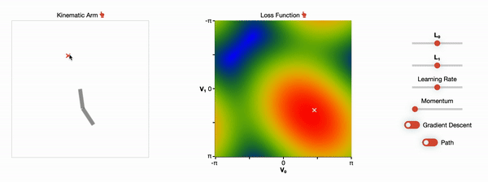
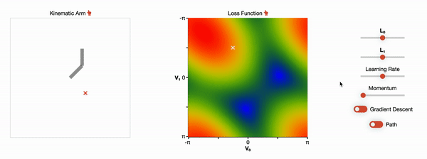

# Inverse Kinematics

## 📝 Description

This project is a visualization and interactive tool for inverse kinematics and gradient descent in general. The inverse kinematics problem is to find the joint angles of an 'arm' such that it minimizes the distance to a target position. In this project i use gradient descent to optimize the joint angles. For the sake of visulization i constrain the problem to an arm with 2 joints in 2 dimensions, but this technique can easily be generalized to higher dimensions.

## 🖥 [Live Demo](https://hojmax.github.io/Inverse-Kinematics/)

In the GIF below you see two draggable plots:

 On the left is the kinematic arm with the target position marked by the red cross.
 On the right is a plot over the parameter space, with the white cross representing the current arm configuration.
 
 Each axis of the right plot represents a joint angle and ranges from -𝜋 to 𝜋. Every possible arm configuration is therefore represented by a single point in the parameter. You can see this visually by how changing the position in the parameter space changes the arm accordingly.
 
 The color coding of the parameter space are a visualization of the loss function. I define the loss function as the distance between the end of the arm and the target. For every possible arm configuration (pixel) i calculate the loss and normalize the value to range between 0 and 1. This value gets mapped between the colors red, yellow, green and blue, where red corresponds to 1 and blue to 0. This is also evident in the GIF, as arm configurations in bluish regions are much closer to the target then more reddish configurations.

In the next GIF gradient descent is turned on:

You can see how the arm now automatically moves towards the target, or rather finds the locally optimal arm configuration. 

There are several other parameters that can be tweaked, such as the segment lengths, the learning rate and momentum. I will not elaborate on these any further, but rather invite you to try them out yourself 😊

## 🏄‍♂️ Usage

As this project is built using vanilla javascript, all you need is to open `index.html` in your browser.
